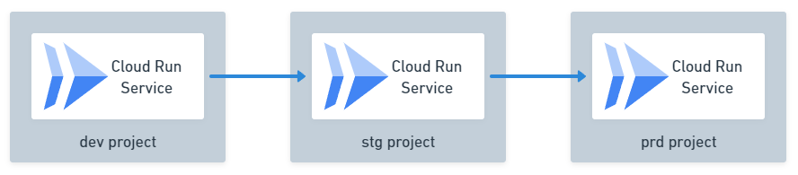

# Serial Delivery Pipeline



## Terraform apply

```shell
cd terraform
terraform init
terraform apply
```

## Configure your project

```shell
PROJECT_PREFIX="your-project-prefix"
REGION="us-central1"
RELEASER_SA="hello-app-releaser@${PROJECT_PREFIX}-pipeline.iam.gserviceaccount.com"
STG_PROMOTER_SA="hello-app-stg-promoter@${PROJECT_PREFIX}-pipeline.iam.gserviceaccount.com"
PRD_PROMOTER_SA="hello-app-prd-promoter@${PROJECT_PREFIX}-pipeline.iam.gserviceaccount.com"
gcloud config set project "${PROJECT_PREFIX}-pipeline"
```

Allow you to impersonate service accounts.

```shell
gcloud iam service-accounts add-iam-policy-binding "${RELEASER_SA}" \
  --member "user:$(gcloud config get account)" \
  --role roles/iam.serviceAccountTokenCreator
gcloud iam service-accounts add-iam-policy-binding "${STG_PROMOTER_SA}" \
  --member "user:$(gcloud config get account)" \
  --role roles/iam.serviceAccountTokenCreator
gcloud iam service-accounts add-iam-policy-binding "${PRD_PROMOTER_SA}" \
  --member "user:$(gcloud config get account)" \
  --role roles/iam.serviceAccountTokenCreator
```

## Deploy to dev

Build and push a new docker image.

```shell
cd deploy
export APP_VERSION=v1.0.0
gcloud config set auth/impersonate_service_account "${RELEASER_SA}"
skaffold build \
  --filename skaffold.yaml \
  --default-repo "${REGION}-docker.pkg.dev/${PROJECT_PREFIX}-pipeline/hello-app" \
  --file-output artifacts.json
gcloud config unset auth/impersonate_service_account
```

Create a new release and deploy the image to dev.

```shell
cd deploy
gcloud deploy releases create v-1-0-0 \
  --region "${REGION}" \
  --delivery-pipeline hello-app \
  --gcs-source-staging-dir "gs://${PROJECT_PREFIX}-pipeline/hello-app/source" \
  --build-artifacts artifacts.json \
  --skaffold-file skaffold.yaml \
  --enable-initial-rollout \
  --impersonate-service-account "${RELEASER_SA}"
```

## Promote to stg

```shell
gcloud deploy releases promote \
  --release v-1-0-0 \
  --delivery-pipeline hello-app \
  --region us-central1 \
  --impersonate-service-account "${STG_PROMOTER_SA}"
```

## Promote to prd

```shell
gcloud deploy releases promote \
  --release v-1-0-0 \
  --delivery-pipeline hello-app \
  --region us-central1 \
  --impersonate-service-account "${PRD_PROMOTER_SA}"
```